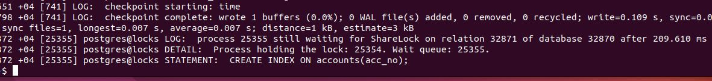

# Домашнее задание № 7 Механизм блокировок

**Цель:**  

понимать как работает механизм блокировок объектов и строк

## Описание/Пошаговая инструкция выполнения домашнего задания

1. Настройте сервер так, чтобы в журнал сообщений сбрасывалась информация о блокировках, удерживаемых более 200 миллисекунд. Воспроизведите ситуацию, при которой в журнале появятся такие сообщения.

```sql
show log_min_duration_statement;  (тек.значение: -1)
show log_lock_waits;  (off)
ALTER SYSTEM SET log_lock_waits = on;
ALTER SYSTEM SET log_min_duration_statement = '200ms';

SELECT pg_reload_conf();

create database locks;
\c locks
CREATE TABLE accounts(
  acc_no integer PRIMARY KEY,
  amount numeric
);
INSERT INTO accounts VALUES (1,1000.00), (2,2000.00), (3,3000.00);
```

2. Смоделируйте ситуацию обновления одной и той же строки тремя командами UPDATE в разных сеансах. Изучите возникшие блокировки в представлении pg_locks и убедитесь, что все они понятны. Пришлите список блокировок и объясните, что значит каждая.

  

  

  

> Номер блокировки сеанса1 = 2206, сеанса2 = 2213, сеанса3 = 2218  
> 2213 ждёт 2206, а 2218 ждёт 2213  

3. Воспроизведите взаимоблокировку трех транзакций. Можно ли разобраться в ситуации постфактум, изучая журнал сообщений?

>tail -n 10 /var/log/postgresql/postgresql-15-main.log  

> В журнале также видно что 2213 ждёт 2206, а 2218 ждёт 2213

4. Могут ли две транзакции, выполняющие единственную команду UPDATE одной и той же таблицы (без where), заблокировать друг друга?
> В теории да, могут так как UPDATE блокирует строки по мере их обновления.  
> Например: в 1 сессии обновление идёт сверху вниз, а 2 сессии обновление происходит снизу вверх и они встречаются и ждут друг друга.  

Задание со звездочкой*
Попробуйте воспроизвести такую ситуацию.

```sql
-- создадим таблицу для примера
create table t1 as
select id, (random() * (1000 - 1) + 1)::numeric(9,2) as price
from generate_series(1,20) as t(id);
select * from t1;

-- создадим индекс в обратном порядке
CREATE INDEX ON t1(price DESC); 

-- функцию для замедленного обновления
CREATE OR REPLACE FUNCTION inc_price_slow(n numeric) RETURNS numeric AS $$
  SELECT pg_sleep(1);
  SELECT n + n*0.1;
$$ LANGUAGE SQL;

-- сеанс 1
UPDATE t1 SET price = inc_price_slow(price);

-- сеанс 2
SET enable_seqscan = off;
SHOW enable_seqscan;
UPDATE t1 SET price = inc_price_slow(price) WHERE price> 1.00;


--в 1 сеансе
ERROR:  deadlock detected
DETAIL:  Process 2206 waits for ShareLock on transaction 330835; blocked by process 2213.
Process 2213 waits for ShareLock on transaction 330836; blocked by process 2206.

```

**PS**: правда во 2 сеансе всё равно пришлось использовать WHERE без него по индексу UPDATE не получался.

